Hello UKPF subreddit or discord member! Here is a step by step on how to help update the wiki :)

## Make a github account

Go to https://github.com/signup and make an account.

Your username will be public. We suggest picking a username based on your reddit or discord username, just so it's easier to recognise people.

Your email address is visible by default but can be hidden - set this up by going to https://github.com/settings/emails and ticking "Keep my email address private").

## Making your first update

This guide will walk you through making a small update, just to demonstrate the process and get everything set up. You are welcome to follow this guide purely for practice and setup, your changes don't have to go live.

There are a lot of screens to click through, that's because github allows for much more complicated setups than we're using. Don't be intimidated:

1. If in doubt press the green button
2. You can't cause any problems on the live wiki so no stress
3. Subsequent changes will be simpler

### Editing a wiki page

The wiki page files live in [src/content/docs](src/content/docs). Look for the page you want to edit, and click on it to open it.

Press the pencil in the top right. You will now be prompted to 'fork' the repository:

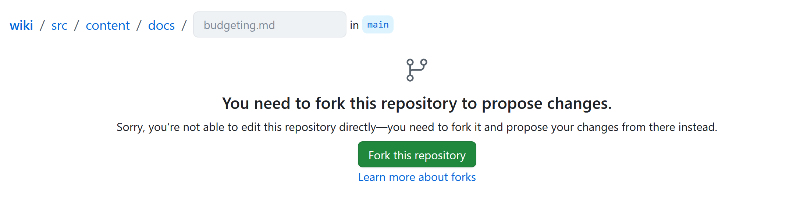

A fork is like a personal copy of the wiki, that you can edit as much as you like. Press the green button to create one.

Make your changes to the page. Wiki pages are written in [Markdown](https://www.markdownguide.org/basic-syntax/), as used on reddit and discord, so should hopefully be familiar, and you can toggle between 'Edit' and 'Preview' to check your markdown has worked.

To save your work, press the green 'Commit changes' button in the top right:

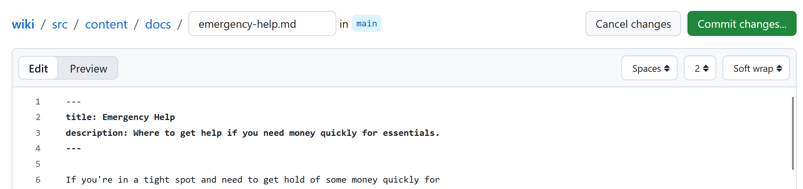

You'll be prompted for a commit message. Write a short description of your update, then press the green 'Commit changes' button:

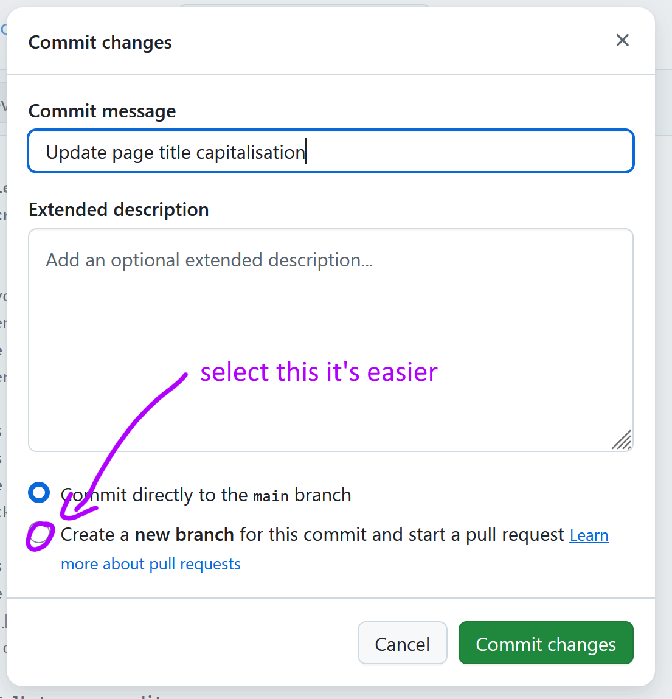

Now go to Pull Requests in the navigation bar. It will look like:

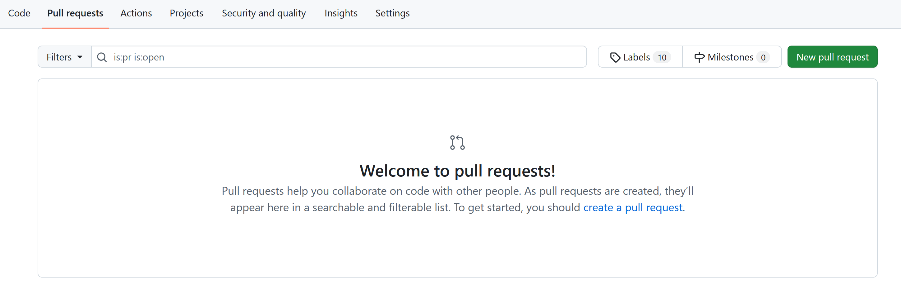

Press the green 'New Pull Request' button. You will now be taken to a preview of your Pull Request. It will show your commit (or commits, if you 'saved' multiple times), and a list of changes that have been made.

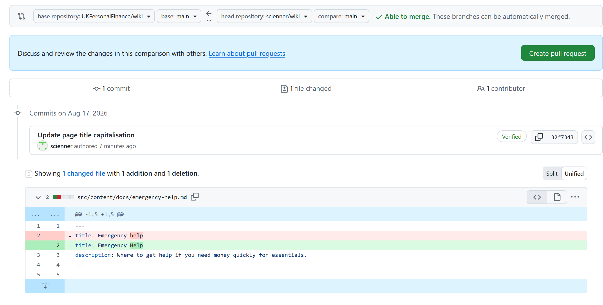

Press the green button, and you will get to this screen:

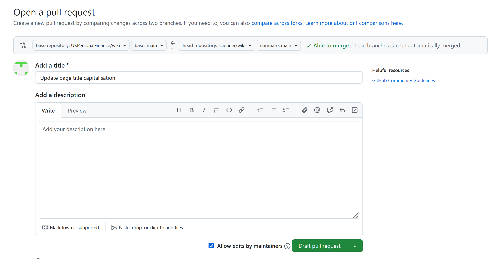

You can just press the green button again. You don't need to add a description, although you're welcome to add some comments here if you want, such as explaining why you made the update or linking to an [Issue](https://github.com/UKPersonalFinance/wiki/issues).

You will now (finally!) be sent to your Pull Request:

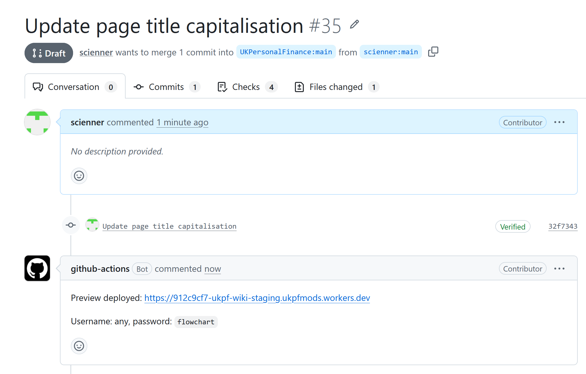

Give github a minute and you should receive a reply from the **github-actions** bot, which builds a temporary version of the wiki with your changes included, so you can check everything worked correctly.

If you want to keep working on your update you can go back to your file, edit it, and commit your changes again. This will automatically be included in your Pull Request, and the bot will update the preview (just give it a min - its comment will show as 'edited').

Note it can sometimes be a bit confusing finding the right place to make your edits. You want to be editing your current PR, not starting from scratch from the live wiki files. If you have a PR open you can always find the right 'branch' associated with it here:

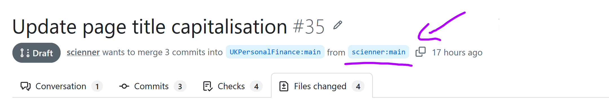

Click on that, and navigate to your files from there.

When you're happy with your proposed changes, go to [Discord](https://discord.gg/kaetMg8) to tell us about it. We can then 'merge' it - accept your pull request to incorporate your changes into the live version.

It's better to make one update at a time. Don't bundle unrelated updates together in the same Pull Request, or if any of them end up requiring discussion the whole PR can end up waiting.

## Making subsequent updates

Now that you have your 'fork', you will not be prompted to create one again for future changes.

Instead, when you press the Edit button, you will now see this:

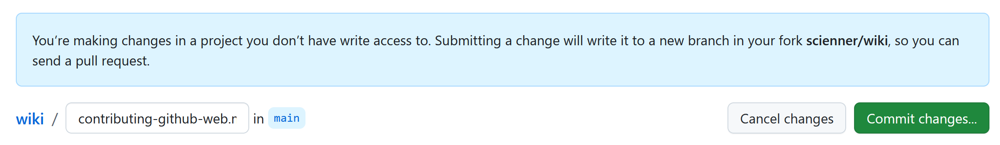

Press 'Commit' to save your changes, and write your commit message:

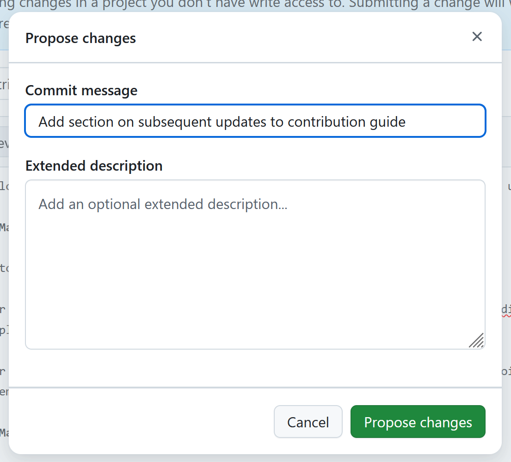

When you press 'Propose Changes', you will immediately be sent to a preview of your PR:

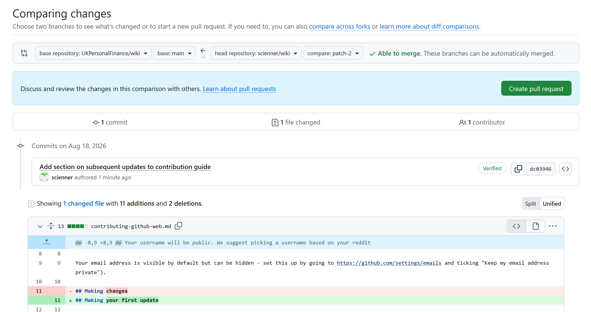

The rest is the same as above:

- When you press 'Create Pull Request', a PR will be created and the **github-actions** bot will build the wiki preview for you
- To make further edits, click on the name of the branch at the top of the PR, navigate to the relevant file, edit it and commit your changes. This will automatically update your PR, and the preview site in the bot comment
- Badger people on discord when it's ready

## Creating new pages, updating the sidebar, adding images, etc

For more info on this kind of stuff, see the [readme](README.md).
