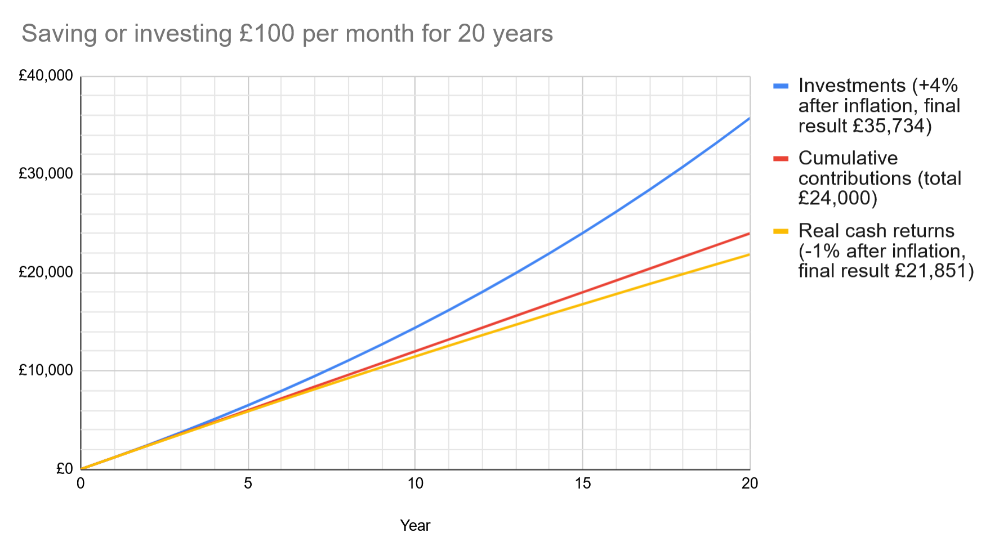

Having a kid? Thinking about saving money for their future needs such as
driving lessons, university, or a deposit? Save some money for them!

In the UK, the main options are:

- Saving or investing in a Junior ISA. This puts the savings into your
  child's name, and becomes accessible to them when they turn 18
- Saving or investing in your own accounts. This allows you to choose how
  much you give and when

## Cash savings vs investments 💸

If your child is young, you should strongly consider investments over cash accounts, as over long periods [stocks are very likely to outperform cash](/investing-101/), and thus avoid inflation eroding your child's savings.

An example of this in action over 20 years:

In general, if you are saving for goals more than 5 years in the future, it's worth considering investing.

If you're new to investing, don't be daunted! Investing can be done very simply and inexpensively, with a 'set and forget' setup. Start with our [Investing 101](/investing-101/) page and try our [Recommended Resources](/recommended-resources/) for more in depth guides.

## Account types

### Children's Savings Accounts

> **Suitable for:**  
> ✅ Short term savings for spending before age 18
>
> **Not suitable for:**  
> ⛔ Longer term savings (>5 years)  
> ⛔ Tax-free savings

Many banks and building societies offer [savings accounts for children](https://www.moneysavingexpert.com/savings/child-savings-tax-free/). Money in children's savings accounts is not locked away until the child turns 18, it can be spent at any age. Account policies will vary on whether the parent or child can withdraw, and at what age. Parents withdrawing money from their children's savings accounts have an obligation to use it for the child's benefit.

Interest earned in savings accounts is subject to tax. Whilst most children do not earn enough money themselves to [pay income tax on their savings interest](/savings/), money given to children under the age of 18 by their parents or step-parents (but not other family members) earning £100 or more interest per year is subject to tax as if it was that parent's savings. This is to prevent parents from avoiding paying tax on their savings interest by storing their savings in their children's names.

As a parent saving for your children, there is **no tax advantage** to savings in your child's account rather than your own. The only financial benefit is if the child's account pays a better interest rate. This is sometimes the case, but tends to be limited to introductory offers. You may find you get better rates in your own savings accounts, and that it's less hassle to stay on top of the best interest rates this way.

Older children may benefit from having a savings account they can transfer pocket money, gifts or income to to save up for things they want to buy, the same way adults use a savings account.

### JISA (Junior ISA)

> **Suitable for:**  
> ✅ Tax-free savings interest and investment growth  
> ✅ Money for your child to receive when they turn 18  
> ✅ Family members who want to save for a child's future directly
>
> **Not suitable for:**  
> ⛔ Money you want to reserve for a specific purpose (e.g. a house deposit)

Junior ISAs come in 'Cash' and 'Stocks & Shares' (investment) variants, much like [regular ISAs](/isa/), and follow similar rules.

Saving into a Junior ISA will not use any of your personal ISA allowance - your child has their own allowance, of £9,000 per year. In the tax year in which the child turns 18, they can use both their £9,000 JISA allowance **and** the standard £20,000 ISA allowance.

Only a parent or guardian can set up a JISA, but once it's set up, other family members or friends can contribute money to it. The parent who opened it remains responsible for managing the account (keeping contact details up to date and making investment decisions) but they cannot withdraw money from the JISA.

When the child turns 16, they are given administrative control over the JISA, but cannot yet withdraw funds from it. On the child's 18th birthday, the JISA becomes a standard adult ISA. These have no restrictions on withdrawals.

As such, you should consider how much money you would like to give your child access to at 18. Whilst we all hope that we will teach our children to be sensible with money, we also hear many stories of 18 year olds spending their JISAs quickly with little to show for it! If you are saving with the intention of this being a nest egg to help with a house deposit, you may wish to consider saving in your own name instead.

### Your own ISA (or pension)

> **Suitable for:**  
> ✅ Flexible help with education, home deposit, and other costs

If you'd like to save money for your child's future but not necessarily for them to have full access to spend at 18, you will need to keep the savings in your own name. This allows you to gift the money to your child at whatever point(s) you consider to be appropriate, such as to pay for living costs during University or to buy a home.

The most common choice for this will be to save in an [ISA](/isa/), but if the timing works you can also consider using your [pension](/pensions/).

Be aware that in the event of your death these savings may be subject to [inheritance tax](/gifts-and-inheritance-tax/) - the money is legally yours. You should make sure your will reflects any specific requests, and that your pension Expression of Wishes is up to date.

Similarly, if you ever need to claim means-tested benefits, savings in your name that you intended for your child will be treated the same as savings you intended for yourself.

### How do I keep the money separate if it's in my name?

If you are saving for your own financial plans and your children in your own name, but want to keep a strict division between your saving and theirs for housekeeping purposes, you can do so in a few ways:

- Open a separate ISA or pension for your child's savings
- Invest in different funds for your and your child's savings. For example, if you are using [index funds](/index-funds/) you can pick two different ones (they can still track the same index).
- If using a single fund, you can make a note of how many units were purchased each time you invest for yourself or your child (your broker will provide this information with each transaction). That way when you end up with a holding of _n_ units, you'll know how many were purchased for yourself and how many for your child/children.
- Some platforms have functionality for dividing up your investments into 'pots' and tracking them separately.

### Mix and match

You don't have to keep all your savings in the same 'pot', you can make use of all of these strategies in whatever combination or proportion works for your family.

## What if I want my children to have money they can't access until age 21 or 25?

This is a commonly asked question, and understandable too. Perhaps you would prefer to hold your child's savings in their own name (whether for personal or tax reasons), but feel that 18 is too young for unrestricted access to the entire amount.

Unfortunately, there is no easy and inexpensive way to put savings in your child's name that do not become accessible to them when they become a legal adult. Any arrangement in which your child is the _beneficial owner_ of these savings, but unable to access them at 18, is known as a _relevant property trust_ in law. These have complicated legal and tax arrangements.

The simplest thing is to either save in your own name (paying any applicable taxes), or to give the gift outright (via JISAs or other children's savings accounts). Or of course some combination of the two.

If you are considering setting up a trust, you should speak to a private client solicitor and/or a [financial planner](/financial-advice/) to fully understand the tax and legal implications, as well as the administrative costs. Expect total costs to be in the thousands of pounds.

## What if I just don't tell them about their JISA until they're old enough to use it responsibly?

The bank will contact your child about their JISA when they turn 16. It's not legal to intercept this and continue running their JISA yourself (just as it would not be for them to do to you). Again, money in a JISA belongs to your child and you should not contribute more to a JISA than you want them to have full access to when they reach the age of 18.

## Other account types

The account types below are unlikely to be useful in most situations - we've listed them for completeness and to explain why they didn't make the cut!

### Junior SIPP

> **Suitable for:**  
> ✅ Helping your child save for retirement
>
> **Not suitable for:**  
> ⛔ Living expenses, higher education, home deposit, etc

If you want to give your child a head start on retirement savings, you can contribute £2880 a year into a JSIPP. This will get tax relief at 20% giving a maximum total contribution of £3600 a year.

When your child turns 18 this will become a regular SIPP and will follow the normal [personal pension rules](/pensions/) regarding income tax on withdrawals and access age restrictions. It therefore can't be used to help your child with university costs, to buy their first home, or any other goals before retirement age.

Calculating the effect of 50+ years of compounding certainly gives impressive results, and at first glance this can give a JSIPP the appearance of providing the best possible value for your children's savings, as it results in the largest return. However it's important to understand that the money does not compound any faster or better in your child's JSIPP compared to your own SIPP, your ISA, or your child's ISA. These savings will be worth similar amounts when your child is 20, 40 and 60 years old. It is only that they remain **inaccessible** for the longest possible period of time if placed in your child's JSIPP.

While many people worry about giving an 18 year old access to savings, it doesn't therefore follow that locking them away until they are retired is the next best option. It's worth remembering that your child will have several decades to prepare for their own retirement, and will be incentivised to do so with employer pension contributions and tax relief. Access to some savings at an earlier age may actually provide more value to their life trajectory than a larger amount when retired - and if given money at e.g. 30 years old, they will still have the option to put these savings in their pension if that is still preferred. There is no specific advantage to setting up a JSIPP while they are under 18 rather than doing so when they are an adult.

However if you are maxing out your own ISA and pension allowances, and already have as much in a JISA as you are comfortable with your child having access to at 18, this option is potentially worth considering.

### LISAs

> **Suitable for:**  
> ✅ Adult children saving for a deposit
>
> **Not suitable for:**  
> ⛔ Children under 18

[Lifetime ISAs](/lisa/) are available in cash and S&S variants, and provide a bonus top-up to savings if used for a first home or retirement. It is possible to withdraw money for other purposes, but the bonus is lost along with a small further penalty, designed to discourage this - which parents often like the sound of!However, you must be between 18 and 40 years old to open a LISA. They cannot be opened on behalf of a child.

You can of course encourage your child to open a LISA when they turn 18, and help them use their allowance.

### Children's GIA

If you have used your child's full JISA allowance, you may be considering a GIA (taxable investment account) in your child's name. Setting up a GIA for a child is possible, but gets complicated as these need to be registered as trusts with HMRC, and are taxed differently depending on whether the funds came from parents (including step-parents) or others. Make sure to research this fully.

### Premium Bonds

Premium Bonds are tax-free, government-backed savings that provide "interest" in the form of a prize draw. Whilst in the past these were a popular choice to purchase for young children, on average they pay less than a standard savings account, so most people (especially anyone saving less than £5,000) would be [better off saving elsewhere](/savings/).
