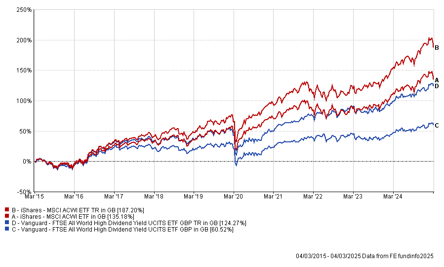

Whether you're thinking about what to do with your savings or your time,
it's often taken as a given that 'passive income' is the best goal to
pursue. For many people the term has become synonymous with success,
wealth, or any type of investing.

In reality, this is not the case, and searching for free income can
actually be counter productive.

## Why do so many influencers talk about passive income?

The short answer is: because it's a really attractive idea. Who wouldn't
want to receive income without needing to work for it?

Because it has such a widespread appeal, low-effort personal finance
books, videos and podcasts will often focus on this topic. Selling the
passive income dream is a very profitable line for influencers, so it is
in their interests to promote it as the best route to success – or even
the only one, with working for money dismissed as a mug's game.

At this point the phrase has basically become a meme, and a red flag
that someone is trying to sell you something.

## Looking for 'passive income'? Look out for scams

If you are looking for opportunities to make passive income you will
quickly find that there's a whole universe of content on this topic,
with many niches for different audiences.

Influencers promising passive income will try to sell their audience on
bogus training courses, access to 'exclusive' communities, personal
coaching, trading tips, or any number of other products they think you
might be willing to pay for in the hopes you can replicate their
apparent success.

The truth is that you will never be able to, because these influencers
are actually making their money from their audience, not from whatever
activity they claim made them wealthy (and that they will kindly teach
you for a fee).

They are also often lying about their wealth and income to appear more
successful, and thus more aspirational and credible.

## I feel like I don't earn enough – how can I increase my income?

If you would like to increase your income, the most efficient way to do
this is generally through your main job. It is almost always better to
look for career progression opportunities than 'passive income' or 'side
hustle' opportunities. Finding a role that pays £5,000 more will likely
be easier to achieve, more reliable, and take up less of your free time
than trying to make £5,000 elsewhere, and investing in your long-term
employability will compound over time.

If you need more income in the immediate term to keep up with costs or
goals, the simplest solutions are things like overtime at your
workplace, or getting an evening or weekend job.

## I have savings – shouldn't they generate an income?

If you've recently started building savings, or perhaps received a lump
sum, your first thought may be: can this provide some income?

It makes sense to want to see some tangible benefit from your savings.
But the issue with focusing on receiving 'passive income' from your
savings is that by taking income out of your investments rather than
re-investing it, you lose some of the magic of compound growth. See the
"dividend portfolios" section below for an example of the impact of
this.

Taking money out to spend now means having less money available in
future. The more you take, the bigger the impact. It sounds obvious when
stated that way but it's easy to miss.

Gains from interest, dividends or growth are not 'free money' – they are
ultimately no different to any other money you have or earn. Spending
£500 of savings interest has exactly the same effect on your finances as
spending £500 of your savings, or £500 of your employment income. (For
those interested in digging deeper into this topic, it is called the
fungibility of money).

Take the time to work through our [flowchart](/flowchart/) and
[lump sum](/lump-sum/) guide and make a financial plan that takes into
account your income, savings, and goals.

## Common passive income suggestions

### Making money online

The appeal of this is obvious – make money from your own home and in
your own time.

'Online' is obviously a broad description that could cover all sorts of
activities such as:

- Freelance professional work (disclaimer: that's just plain work!)
- Affiliate marketing commissions (disclaimer: difficult to make sales
  unless you already have a relevant audience)
- Selling creative works such as ebooks, apps, printables, sewing
  patterns, etc (disclaimer: also difficult to make sales in a crowded
  marketplace)
- Drop-shipping – setting up a storefront that automatically ships from
  cheaper retailers overseas (disclaimer: trading standards rules make
  this hard to do legitimately, you are in competition with huge
  businesses like aliexpress and temu)
- Trading crypto or FX (disclaimer: basically gambling and a great way to
  lose all your money)

It's important to remember that even online, truly 'passive' income is
rare. Most opportunities involve being paid for your work (time, effort,
and skills), and will require active effort and maintenance.

This area is particularly rife with scams. If something sounds too good
to be true, it probably is.

### Buy to let

Our [Buy to Let](/buy-to-let/) page compares BTL to investing in
stocks and shares. For many people, BTL is not very tax efficient, or
particularly "passive". It tends to take more time and effort than
people guess, and may not provide the best post tax returns.

### Living off investments

Living off savings and investments is very much possible – it's called
retirement! The difficulty is that it takes far more in savings than you
might expect. This is why it takes most people several decades to save
enough to retire safely.

Exactly how much income you can take from your investments to avoid
running out within your lifetime is not a simple question, and depends
on many factors. However for very quick (napkin level) calculations, a
reasonable number to use is 4%. That means an investment of £100,000
could return an income of £4,000 per year, or £333 per month. Replacing a
full income therefore requires a very hefty sum.

If you are still earning and saving, you are better off letting your
savings grow than taking income from them to spend.

### Dividend portfolios

Dividends often appeal to income-focused investors. Spending dividends
can feel less painful than selling some of your stock.

But dividends are not 'free' – by taking them out to spend rather than
re-investing them, you will slow your growth.

The other challenge is that you significantly limit your investment
universe by prioritising high dividends investments. For example, an
investment that returned 6% growth would be better value than one that
returned 2% growth and 2% dividends. Prioritising dividends is a form of
active investing, and the research on its drawbacks is conclusive.

The example below shows the results of investing £100,000 10 years ago
in a global index fund, and in a high dividend yield fund, with
dividends reinvested or taken as income:

| Investment | Result |
|---|---|
| MSCI All-World index – dividends reinvested | £289,549 |
| MSCI All-World index – dividends taken as income | £237,103 final value + £40,109 dividends taken = £277,212 total |
| FTSE All-World High Dividend Yield index – dividends reinvested | £227,839 |
| FTSE All-World High Dividend Yield index – dividends taken as income | £163,070 final value + £41,533 dividends taken = £207,570 total |

### Starting a business

Owning a profitable business certainly has a higher possible income
ceiling than working as an employee. However it comes at a high risk –
most startup businesses fail.

There is also no one business that anyone can reliably succeed at, even
if you have start up capital to spend. Someone who can run a restaurant
can't necessarily run a marketing agency or a construction business.

If you have an idea that you think you could develop into a successful,
scalable business, we're not here to tell you otherwise! But do plan
carefully and realistically, and consider whether the time and effort
spent on a project like this will be worth the returns. Start-up costs,
running costs, time costs, and opportunity costs all need to be weighed
up.

If your starting point is not that you have a potentially viable
business idea, but rather that you have money and are looking to get the
best returns from it, searching for business ideas is unlikely to be the
way to go.
