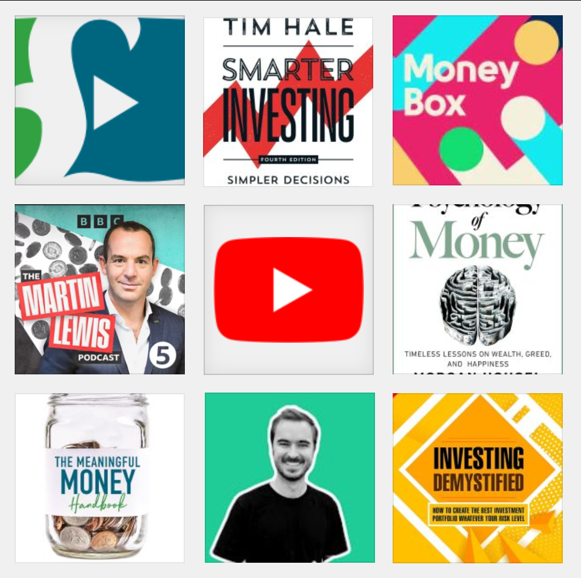
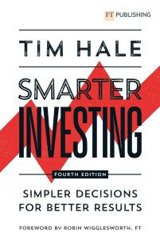
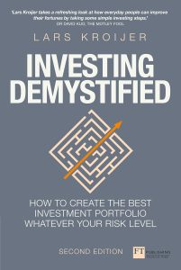
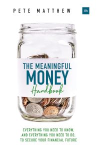
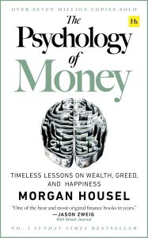
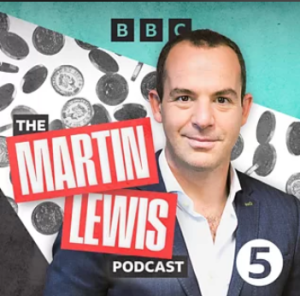

There's always more to learn, and we have picked some of the best websites,
books, podcasts and videos below.

## Useful websites

This wiki! We have [**pages on many topics**](/).

**[MoneySavingExpert](https://www.moneysavingexpert.com/)**: When it comes to
keeping track of the best savings accounts or credit cards, and great money
saving tips, no one can beat MSE.

[**gov.uk Money and Tax pages**](https://www.gov.uk/browse/tax): The official
gov.uk pages are clearly written and very helpful if you want to check topics
like [Income Tax](https://www.gov.uk/income-tax-rates), [National
Insurance](https://www.gov.uk/national-insurance-rates-letters), [pension tax
relief](https://www.gov.uk/tax-on-your-private-pension/pension-tax-relief),
[Capital Gains Tax](https://www.gov.uk/capital-gains-tax), [Inheritance
Tax](https://www.gov.uk/rent-room-in-your-home/the-rent-a-room-scheme), etc.

[**Monevator**](https://monevator.com/): UK-focused investment and personal
finances blog, with a wealth of knowledge going back many years – always
worth searching for any topic. See especially their series [Investing
Lessons for Beginners](https://monevator.com/tag/investing-lessons/).

## Videos

:::caution[️YouTube warning]
Like most social media sites, when it comes to financial content YouTube is
plagued with [scams, bogus get-rich-quick
schemes](/scams/), and misinformation – be careful
when searching for things to watch. However there is also some great quality
content available. We have some recommendations below.
:::

And no, we don't know of any short-form video content to recommend.

Our favourite youtube channels, both of which are currently active and with
extensive archives on many topics are:

**[Meaningful Money](https://www.youtube.com/c/MeaningfulMoneyUK)**: Pete
Matthews, a UK based financial planner, uploads shorter videos on many topics
from retirement, investment, tax, UK state pension and more.

[**James Shack**](https://www.youtube.com/c/JamesShack): UK based financial
planner, uploads in depth videos on investing, mortgages, retirement and
other subjects

You may also like:

- [**Damian Talks Money**](https://www.youtube.com/channel/UCjPR68IfHV0aY9s6cF5u0uQ)
  is UK based, friendly and engaging, and posts beginner friendly content
  like [Is now a good time to invest?](https://www.youtube.com/watch?v=2290FfBFIzE)
  and step by step walkthroughs of popular brokers' websites.
- **[How to Win the Loser's Game – by sensibleinvesting.tv](https://www.youtube.com/watch?v=SwkjqGd8NC4)**
  a 1hr documentary
- Lars Kroijer, author of Investing Demystified, has a useful [series on
  building your own financial planning spreadsheet](https://www.youtube.com/watch?v=1LUIQa5hgMg)
- [**Ben Felix**](https://www.youtube.com/channel/UCDXTQ8nWmx_EhZ2v-kp7QxA) is
  Canadian financial planner, but much of his content applies equally to UK
  investors

## Books

**[Smarter Investing by Tim Hale](https://www.amazon.co.uk/Smarter-Investing-Simpler-Decisions-Results/dp/1292444401/)**: The ultimate counterpoint to attempting to
"beat the markets" – after spending 15 years working in active fund
management, Tim Hale concluded that the best outcomes for most investors in
most situations would be a simple portfolio of "passive" investments.

**[Investing Demystified by Lars Kroijer](https://www.amazon.co.uk/Investing-Demystified-investment-portfolio-Financial-dp-1292156120/dp/1292156120)**: How To Invest Without Speculation
And Sleepless Nights – Simple, stress-free investing advice by former hedge
fund manager Lars Kroijer. He also has a [youtube
channel](https://www.youtube.com/c/LarsKroijer) of the same name.

**[Meaningful Money by Pete Matthew](https://www.amazon.co.uk/Meaningful-Money-Handbook-Everything-everything/dp/0857196510)**: Straightforward approach to budgeting,
planning, saving and investing from the host of the [Meaningful Money
podcast](https://meaningfulmoney.tv/mmpodcast/) and [youtube
channel](https://www.youtube.com/c/MeaningfulMoneyUK).

**[The Psychology of Money by Morgan Housel](https://www.amazon.co.uk/Psychology-Money-Timeless-lessons-happiness/dp/0857197681/)**: A collection of short stories
about how different people think about money. The message is well delivered
and gets you to think about money, wealth and happiness in everyday life.

You may also be interested in…

- **[Money: A User's Guide – Laura Whateley](https://www.amazon.co.uk/Money-Users-Guide-Laura-Whateley/dp/0008308314)**:
  This is a thoroughly written guide to personal finances in the UK, with a
  lot of detail on many topics (renting, getting a mortgage, credit cards and
  loans, ISAs and pensions, state pension, taxes, etc) as well as sections on
  navigating money in relationships and friendships.
- **[Your Money Matters](https://www.young-enterprise.org.uk/teachers-hub/financial-education/resources-hub/financial-education-textbook/)**
  – a textbook for 14-16 year olds developed by
  [moneysavingexpert](https://www.moneysavingexpert.com/) to follow school
  curriculums. It is available for free download and covers topics such as
  spending and saving, borrowing, debt, insurance, student finance and future
  planning
- **[The Richest Man in Babylon – George S. Clason](http://thediamondsmine.com/files/Ebooks/Clason-RichestManInBabylon.pdf)**:
  First written in 1926 (original version linked as PDF), with various
  re-issues and updates available in print form. Very sound basic financial
  advice written as compelling parables from the age of Babylon. Still
  accessible and helpful reading today.
- **[Berkshire Hathaway's annual shareholder letters – Warren Buffett](http://www.berkshirehathaway.com/letters/letters.html)**:
  A series of essays over the years from the world's most successful
  investor. Makes interesting reading!

## Podcasts

We really enjoy the **[Meaningful Money podcast by Pete
Matthew](https://meaningfulmoney.tv/mmpodcast/)**.

He even has a [series walking you through the
flowchart](https://meaningfulmoney.tv/2023/05/17/finance-os-intro/).

The Financial Times have [**Money Clinic with Claer
Barrett**](https://www.ft.com/money-clinic-with-claer-barrett), interviewing
guests about their real-life financial situations and offering suggestions
from experts.

Martin Lewis has a **[podcast on BBC Radio
5](https://www.bbc.co.uk/sounds/brand/p02pc9xt)**, with similar content to
his TV show.

Radio 4 have **[Money
Box](https://www.bbc.co.uk/programmes/b006qjnv/episodes/downloads)**, which
covers a wide variety of personal finances questions and news.

## Online Courses

Open University have free courses you can take:

- [Managing my Money](https://www.open.edu/openlearn/money-business/managing-my-money/content-section-overview?active-tab=description-tab),
  and [Managing my money for young
  adults](https://www.open.edu/openlearn/money-business/personal-finance/managing-my-money-young-adults/content-section-overview)
- [MSE's Academy of Money](https://www.open.edu/openlearn/money-business/mses-academy-money/content-section-overview?active-tab=description-tab)
- [You and your money](https://www.open.edu/openlearn/money-business/personal-finance/you-and-your-money/content-section-0?active-tab=description-tab)

Want to discuss your finances, investment strategies or contribute to this
wiki? [Join our Discord server!](/community/)
