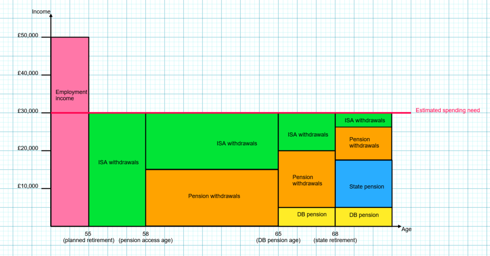

In the previous pension stage on the flowchart you made sure that you
were opted in to your workplace pension, and we encouraged you to
increase your contributions beyond the minimums.

However, that doesn't guarantee you are saving enough for a comfortable
retirement. To work out how much you may need to save takes a bit more
research and calculation. If you are ready to start putting together a
more detailed retirement savings plan, this page is for you.

This page assumes you have already addressed everything from our
[pensions](/pensions/) page, and have spent some time [setting
financial goals](/goals/).

## How much should you save per month for retirement?

There is no set amount. It depends on:

- How much income you need/want at retirement
- When you intend to retire
- Your existing retirement savings
- How much you can afford to save

Bringing all of these together will allow you to create a workable plan.

### Your desired retirement income

The ideal way to come up with a budget for retirement is to create a budget based on costs. For example, you can take your [current expenses](/budgeting/) as a baseline, then make any planned adjustments, such as excluding mortgage payments and commuting costs, and adding more budget for leisure and health expenses.

You don't have to make a final decision on a specific budget, it's fine to come up with a range of options to look into.

If you are young and retirement is a long way off, you likely won't be able to create a budget based on costs, as there will be all sorts of things you don't yet know - where you'll live, whether you'll have children and/or a spouse, what kind of lifestyle you'll want, and so on. In this case, you will need to use rough estimates for now, and refine as you get closer to retirement.

You can also reference the [Retirement Living Standards](https://www.retirementlivingstandards.org.uk/).

### What about inflation?

You may be wondering what a budget of e.g. £20,000 or £50,000 will actually cover in decades' time, as the prices of food, transport, energy and other expenses increase over time. This is known as inflation.

Because it is very hard to intuitively understand what £20,000 is likely to be 'worth' at some far point in the future, retirement planning tools work in 'today's money'. So when you plan a budget of £20,000 or £50,000, what that means is 'a budget that will have around the same purchasing power as £... has today'. The actual numbers in your bank account in 2060 will be different, but you don't need to worry about what they will be. You can use the ones that are current and familiar to you.

This is done is by accounting for inflation within the estimates for your pension growth. For example, if you assume inflation averages 2.5% year on year, that means 2.5% of your investment growth is used up just keeping up with inflation. Only growth above inflation is 'real' growth.

If you use a 'real' (after inflation) growth % in your calculations, you can treat the resulting numbers as in 'today's money'.

This approach is standard in most calculators you can find online, as well as pension statements sent by product providers. When they estimate you will have a total pot worth £x, or income of £x, you do **not** need to try to discount this by inflation, or to increase your desired budget by inflation.

### What about large, infrequent expenses?

When thinking about how much income you need, you may prefer to have one budget for regular living costs, and a separate budget for large, one-off expenses such as mortgage payoff, a new roof fund, or gifts for children's university/weddings/home deposit.

For example, if you calculate that your desired budget without a mortgage would be £30,000/year, and you will owe £40,000 on your mortgage when you retire, you can consider £40,000 of your savings fenced off for mortgage payoff, rather than accounting for mortgage payments in your desired annual budget.

For more regular but still infrequent expenses, such as replacing a car, you can "capitalise" the cost for each year. Let's say you expect to spend £20,000 changing cars every 5 years in retirement - divide the cost by the number of years, and add (20,000 / 5) = £4,000 to each year's expenses.

## Your currently expected retirement income

Having worked out a desired retirement income (or a range of possibilities) to look into, your next step is to take stock of the retirement savings you are already on track for, so you can see how they compare to your plans.

Your future retirement income is likely to come from multiple sources. You will need to check each one separately and add them up.

### State pension

The amount of State Pension you will receive depends on the number of qualifying NI years you have. The age you can start to claim it from varies from 66-68.

The simplest and most accurate way to find out how much state pension you are on track to receive, and when from, is to **check your personal state pension forecast** using the gov.uk tool: [https://www.gov.uk/check-state-pension](https://www.gov.uk/check-state-pension)

You may have read that you need 35 years of NI contributions to achieve the full new State Pension, but this is a bit of a simplification. Years prior to 2016 (when the new State Pension was introduced) may affect the number of years you actually require, so it could be more than 35, or even less. The detailed explanations of how different years are calculated are too complicated for this page. Don't assume - [check](https://www.gov.uk/check-state-pension)!

State pension income is generally expected to grow along with inflation, given that successive governments have protected the ["triple lock" arrangement](https://www.moneyhelper.org.uk/en/blog/retirement/state-pension-triple-lock).

### Defined Contribution pensions

Most workplace and personal pensions are Defined Contribution ('DC') pensions. These are personal 'pots' of money, which you and your employer contribute to.

This money is invested, and over time, investment returns as well as new contributions from yourself and your employer will build up the value of the pot. You can then use this money when you retire, by taking out a regular income and/or lump sums. You can access this money from 'normal minimum pension age', which is currently 55-57 depending on your age.

To estimate how much **income** this pot could provide at your target retirement age, you can use an online calculator.

- We particularly like this PensionBee calculator as it offers a good visual illustration of a range of possible outcomes: [https://www.pensionbee.com/uk/pension-calculator](https://www.pensionbee.com/uk/pension-calculator)
- Many other pension providers will offer calculators. Functionality and assumptions may differ between them so it's worth trying a few. See e.g. [Aviva](https://www.aviva.co.uk/retirement/tools/my-retirement-planner/), [Fidelity](https://www.fidelity.co.uk/retirement/calculators/retirement-calculator/), [Hargreaves Lansdown](https://www.hl.co.uk/pensions/pension-calculator/about-you/), [Royal London](https://www.royallondon.com/guides-tools/pension-guides/pension-tools/pension-calculator/), [Vanguard](https://www.vanguardinvestor.co.uk/what-we-offer/personal-pension/pension-calculator)

Note that these calculators tend to make relatively cautious assumptions (see [section on assumptions below](#assumptions)). They would rather suggest you should save more, than have you end up with not enough.

If you want more control over all the calculations, you can also build your own model in Excel. Lars Kroijer, the author of 'Investing Demystified', has a [short video series](https://www.youtube.com/playlist?list=PLXy71rkGuCjXLg9N8zowwUpXCYfBcMJFK) on this topic.

### Defined Benefit pensions

Some workplaces have Defined Benefit ('DB') pensions, often known as "final salary" or "career average" pensions. These are most common in the public sector. They give you a guaranteed retirement income for life. The amount of income is based on your length of service and your salary while working.

Rather than having a pot of savings you need to manage, it is more like receiving a monthly wage, increasing with inflation. This makes them very easy to plan around.

If you are (or have previously been) a member of a DB scheme, it is really worth taking the time to familiarise yourself with what income you can expect from what age. You should be able to log into the scheme website's members area to get a personalised statement.

It's also worth checking what options you may have to buy a higher pension income from the scheme. Whether this is possible or not, and whether it's good value or not, varies from scheme to scheme.

If you have any questions about how your DB pension works, it's really worth seeking help from your employer, your union, or our [subreddit or discord](/community/).

### Other savings (e.g. LISAs or ISAs)

Savings don't have to be placed inside a pension to be used for retirement. If you have savings in an ISA, LISA, GIA, or bank account, *and you intend to leave them until retirement*, you can include these in your planning.

To work out how much income these savings may provide in retirement, you can treat them similarly to a DC pension. However, the age you can access them and the way they are taxed is different. Please see our [ISA vs LISA vs Pension](/isa-vs-lisa-vs-pension/) page to learn more about this, and think about where you may want to direct ongoing contributions to.

### Don't forget to account for tax!

If your budget is based on a monthly or annual spend, you will need to account for tax to make sure you have enough **net income**. Check whether the calculator you are using works on income before or after tax - most will use "before tax" numbers for simplicity.

Note:

- You still have a [personal allowance](/income-tax/) each year
- 25% of your pension is tax free (although there is a limit to this which comes into play if your pension is over £1m)
- You do not pay National Insurance on pension withdrawals, even if you are under state pension age

## Adjusting your pension contributions

If the calculations above have uncovered a shortfall between the retirement income you are currently on track for and the income you will want/need at your target retirement age, you will need to make some adjustments:

1. Increase your pension contributions
2. Plan for a later retirement age
3. Plan for a lower income in retirement

The calculators you used above should help you work out how much of each will be necessary to make the numbers add up.

## Reviewing over time

We've mentioned a few times on this page that you'll have more information the closer to retirement you get. That applies to your desired retirement budget, how long you want to work for, how much you have earned and saved over your career, how your investments have performed, any changes the government may make to state pension or tax bands/rate, and so on.

It's unavoidable that the further away you are from retirement, the harder it is to plan with any accuracy. The problem with this is that the *closer* to retirement you are, the harder it will be to **make up any shortfall** in your savings.

For this reason, you can't wait until everything is decided to start planning and saving. We'd also suggest erring on the side of caution in your assumptions, and reviewing your plan regularly. This needs to happen less frequently when you're younger (perhaps every few years, or following major changes like a new job or home), but as you approach retirement this should be reviewed annually. This will give you a chance to adjust as things change, and allow your plans to become more and more concrete over time.

## Risks to consider

### Predicting future contributions

If you are just starting out in your career, you may be wondering whether it's really necessary to scrape together £100/month of additional pension contribution now, or if it can wait until until you're earning more (and/or have completed other goals such as buying a home), when you expect to more easily afford a larger amount.

Most calculators will allow you to select whether you intend to maintain your current pension contributions until retirement, or increase them over time. Toggling this setting will show that this choice can have a huge impact. It is certainly worth increasing your pension contributions as your pay increases or affordability improves.

We would however caution against relying on future pay rises to entirely fund your retirement. You may end up pursuing better work/life balance over higher pay, or finding that increased pay is taken up by increased costs. Ideally you should aim to fund at least a basic acceptable retirement from your current income.

Another common reason we hear for putting off increasing pension contributions is concentrating on mortgage payoff. Please see our [mortgage overpayments vs investments](/mortgage-overpayments-vs-investments/) page for an explanation of why this isn't always as good an idea as it may seem. Although the page focuses on ISA contributions as a comparison, the logic still stands for pensions (and more so with the extra tax relief!).

### Expecting future lump sums

If you expect to eventually inherit money from your family, can you worry less about saving up out of your income? What if you plan to downsize when you retire to free up some cash?

You know your own situation best, but in general, relying on this type of future boost to your savings is very risky. Inheritance may end up needed for care costs or otherwise redirected, and downsizing especially rarely offers the expected savings. You should at least have a plan for what to do without it.

### Changes to government rules

It is sometimes suggested that it is safer not to include the state pension in your retirement planning, in case future governments change the eligibility rules or amounts paid.

There's no way for us page authors to know the future but we would expect that any changes to the state pension would be published far enough in advance for people to plan accordingly. For many people, the state pension forms a substantial part of their expected retirement income. This means that any changes to the scheme would have a large impact.

There are other potential risks around changes to rules. Large pension pots (typically over £1M) have been subject to an ever-changing tax regime. The way pensions are taxed on death is likely to change from 2027. Other changes have been discussed over the years - limits on salary sacrifice schemes, or reduction of tax relief for higher earners. Stay informed over the years so you can adjust your plans accordingly.

### Sequence of returns {#SORR}

Bad years have a much higher impact on your retirement savings as you approach your target age, as you have less time for your investments to recover. A handful of "bad" early years in retirement can also have a disproportionate effect on your retirement over the long-term.

This is best demonstrated with a comparison table or chart, for example see the illustration in [this blog post from Baillie Gifford](https://www.bailliegifford.com/en/uk/individual-investors/insights/ic-article/2025-q2-monthly-income-sequencing-risk-10055461/).

As you get closer to retirement, this becomes an important risk to consider. Dealing with sequence of returns risk is a whole topic in itself, but the short version is that it usually involves:

1. Reducing the risk taken by your investments as you approach retirement - for example, from 100% global equities when 10 years away, to 60% global equities and 40% global bonds on the day you retire.
2. Holding more cash when withdrawing from investments, so that withdrawals can be put on hold in "bad years".

### Cash flow planning

As you approach retirement, you may find it useful to build a basic "cash flow forecast". This takes quite a bit more effort than straight-line projections, but as you approach retirement the details matter more. It is also useful for visualising early retirement plans, when certain forms of income won't be available.

An example of a simple visual cashflow forecast:

This illustration includes:

- Using exclusively ISA savings before "normal minimum pension age"
- Temporary higher pension withdrawals between "normal minimum pension age" and "state pension age"
- DB pension income replacing some of the ISA withdrawals
- State pension income replacing some of the ISA and pension withdrawals

Using this visual approach can help to identify any areas of shortfall.

A properly qualified financial planner (see the [advice section below](#advice)) can model this for you using software.

## Notes on parameters/assumptions used for calculations {#assumptions}

The most important thing to remember is that the parameters you use in your calculations will not directly determine your results - it will only affect **your planning** (how much you decide to save, and ultimately when you decide to retire).

It can be tempting to put optimistic numbers in your calculations. For example, 'if I put investment growth at 8% real returns, I'm already on track for a great retirement, and I believe with a high risk portfolio I can achieve this rate'. But it's important to bear in mind that these assumptions are just that, and that you will need to include possible worse outcomes in your planning.

### Investment returns

Adjusting your assumptions of investment returns will make a big difference to your overall results. This is especially true if you are young with decades to go before retirement.

So what's the 'right' number to use? Unfortunately, there's no easy answer, which is why calculators generally provide a range.

In our [investing 101](/investing-101/) page, we discussed that since 1900, investing in equities for a long term has produced an annual, after-inflation return of 4.9% (see [page 93, ‘Long-term asset returns’](https://am.jpmorgan.com/gb/en/asset-management/adv/insights/market-insights/guide-to-the-markets/)).

The caveats:

- There is no guarantee that the next 10, 20, or 40 years will match this average.
- Index returns are gross of any costs (i.e. fund fees, platform charges, any tax paid)
- This average is for equities only. As you approach retirement, you will likely need to reduce the risk level of your investments (see '[sequence of returns risk](#SORR)' above). De risking typically involves introducing bonds as an alternative to equities, which will reduce average returns (in exchange for reducing the risk of disasters).

## Withdrawal strategies & safe withdrawal rates {#SWR}

### Background

Prior to 2015, there were relatively few options when it came to pension withdrawals in the UK. The default approach was to give your pension savings to an insurance company in exchange for a guaranteed income for as long as you lived, and little or no capital value on death. These products are known as annuities, and effectively seek to behave like final salary pensions.

In 2011 the rules on alternatives were relaxed, and then relaxed further in 2015, and almost overnight the default approach become "flexible income withdrawals" (FCA data showed that annuities accounted for 90% of pension transactions in 2014, and just 9% of pension transactions in 2015).

There are lots of potential benefits to flexible access to pensions, but the risk is moved entirely to you, the planholder, rather than being borne by an insurance company. The main risk is running out of money prematurely.

### Safe Withdrawal Rates

A 'safe withdrawal rate' refers to how much income you can safely take per year (generally increasing with inflation) and have a very low risk of running out. Note that using a 'safe withdrawal rate' does not necessarily mean you preserve the initial capital, just that you have a very low risk of running out within your lifetime.

Methods for calculating 'safe withdrawal rates' have been argued about for as long as the concept has existed, and estimates range from about 2.5% to 4.5%. This is actually a very wide range. To withdraw £15,000 at 4.5% would require you to have £350k invested, at 2.5% you would need £600k!

So which number should you use? Again, discussing this would easily be a page in itself. Some strategies to consider about include:

- Consider a range of withdrawal rates, instead of banking your whole retirement planning on a single rate. As yourself '*could I survive on 2.5% withdrawals?*' - *'how would my retirement change if I could withdraw at 4.5%?'*
- You could purchase an annuity with your saved retirement funds, rather than (or in combination with) drawing from them flexibly. This sort of decision is outside of this page's scope, and [professional advice](/financial-advice/) should be sought.
- You could use current "annuity rates" as a proxy for safe withdrawal levels. Just be aware that these rates can fluctuate significantly over time.
- Seek help from a [professional financial planner](/financial-advice/) with expertise in building variable models. Terms you want to ask about are "monte carlo forecasting", "bootstrapping/backtesting" or "stochastic modelling".
- If you want to learn more yourself, consider some specialist resources such as [Beyond the 4% Rule by Abraham Okusanya](https://www.amazon.co.uk/Beyond-4-Rule-retirement-portfolios/dp/1985721643), or by searching for and learning more about  withdrawal strategies such as Bengen's 4% fixed rule, Guyton-Klinger guardrails, or the Boglehead Variable Percentage Withdrawal Approach.

## Retirement age

When estimating your retirement income, you will quickly notice that the age at which you plan to retire makes a **huge** difference to the amount of retirement income you can expect.

This is because of the triple impact for each earlier year:

1. One year less of contributions
2. One year less of investment growth
3. One year more of withdrawals

These impacts all compound with each year earlier you decide to retire, and makes your desired retirement age one of the most important decisions for you to think about.

This applies to DB pensions as well as DC. Retiring early means the scheme pays out a guaranteed income for more years, while you pay in for fewer years. For this reason, taking your pension early will have a significant impact on the amount of income you can expect.

This is known as an 'actuarial reduction', and is designed so that on average, members of the scheme receive the same total benefit relative to their number of years in the scheme. It is not a 'penalty' designed to discourage employees from retiring early!

## Related topics

### Planning drawdown

This page is intended to help plan how much to save for retirement. If you are close enough to retirement to start thinking about your drawdown strategy, you'll encounter a whole new set of questions and terminology: drawdown, crystallisation, UFPLS, annuities... these are all beyond the scope of this page.

Government-backed service [PensionWise](https://www.moneyhelper.org.uk/en/pensions-and-retirement/pension-wise) offer one free pension guidance appointment to over-50s.

You can also consider paying someone for advice on this if you're not confident DIYing your drawdown strategy.

### Getting professional advice {#advice}

See our page on [financial advice](/financial-advice/) for more info on getting professional advice.

If you are looking for a professional cash-flow forecast, look for advisers and planners that offer this service specifically, particularly those who hold the *Certified Financial Planner* qualification.

### Inheritance tax

It is worth noting that whilst pensions are currently exempt from inheritance tax, this is changing in April 2027, which may impact your choice as to how much money you wish to put aside in your pension vs distribute in your lifetime. See our page on [IHT](/gifts-and-inheritance-tax/) for further details on inheritance tax.
